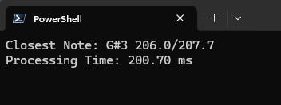

# PyTune - A Real-Time Guitar Tuner
PyTune is a real-time pitch detection application that analyzes audio from your microphone to identify musical notes, perfect for tuning guitars and other instruments.

## Features
- **Note Recognition**: Detects musical notes as you play with approximately 200-ms latency
- **Signal Processing**: Uses Hanning window and DFT analysis for detection
- **Noise Filtering**: Automatically removes electrical mains hum interference

## Tech Used
- **Python**: Core language
- **PyAudio**: Real-time audio I/O
- **NumPy**: Numerical computations and processing
- **SciPy**: DFT (Discrete Fourier Transform) Signal Processing

## Setup & Installation
```bash
pip install pyaudio numpy scipy
python guitar_tuner.py
```

**Note**: You may also find PyAudio's source download files from  [Python Package Index - PyAudio](https://pypi.org/project/PyAudio/).

## Usage
1. Run the script and allow microphone access  
   **Note**: You need to set your microphone as the default input device in your OS.
3. Play a single note on your instrument
4. Read the display showing:
   - Detected note name (e.g., E4, A3)
   - Actual frequency vs target frequency
5. Adjust tuning until frequencies match
6. Press `Ctrl+C` to exit

### Standard Guitar Tuning for Reference
- **E2**: 82.41 Hz | **A2**: 110.00 Hz | **D3**: 146.83 Hz
- **G3**: 196.00 Hz | **B3**: 246.94 Hz | **E4**: 329.63 Hz

## Technical Specs
| Parameter | Value |
|-----------|-------|
| Sample Rate | 88,200 Hz |
| Window Size | 44,100 samples (0.5s) |
| Frequency Range | 62 - 22,050 Hz |
| Update Rate | ~4 Hz |
| Tuning Standard | A4 = 440 Hz |

## Sample Operation


## Current Issues & Future Implementations
The pitch detection is more accurate on higher frequencies, less so on lower frequencies. Recording in a noisy setting seems
to further exacerbate this effect. I will likely have to make changes to the window or experiment with reducing the mains hum removal effect.  

In the future, I'd like to add some sort of UI to this tool and package it to make it more accessible and user-friendly. I've been looking into Tkinter as
an option for this, but I likely won't start working on it until after my exams.

## Credits
Inspired by chcicken's "Programming a Guitar Tuner with Python". Check out his blog post for a deeper dive into
signal processing and a more comprehensive implementation. [Link](https://www.chciken.com/digital/signal/processing/2020/05/13/guitar-tuner.html#hps)
